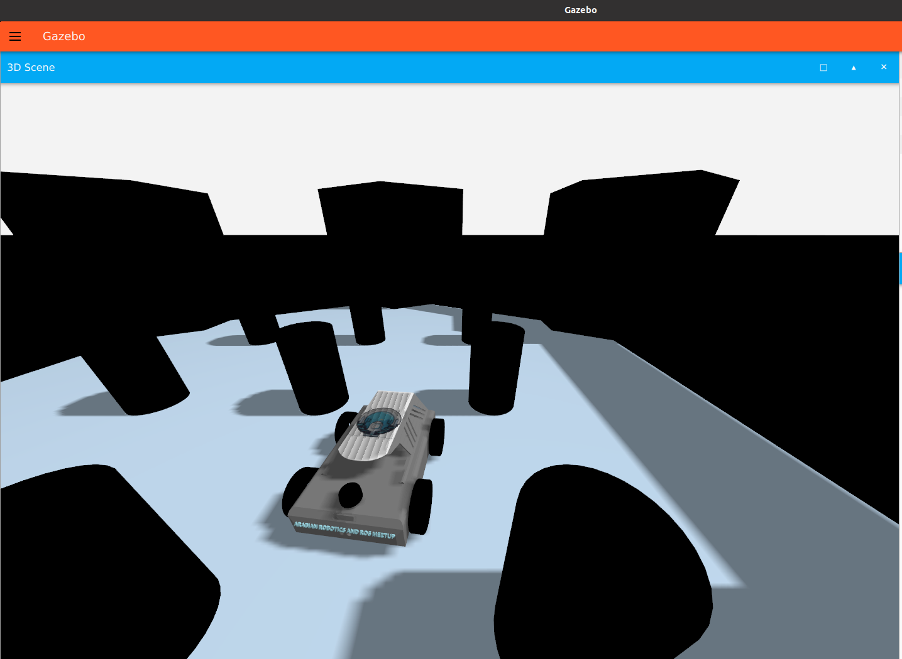
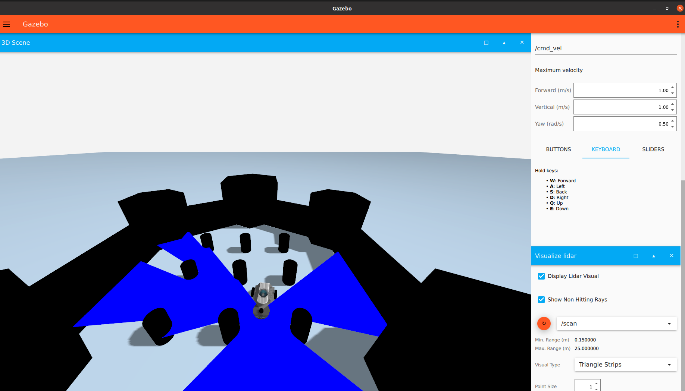
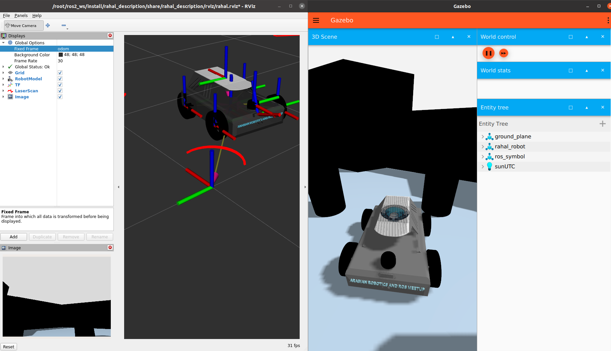

# Rahal Robot With ROS2

This repository contains the description and SLAM functionality for the Rahal Robot, leveraging **Gazebo Sim (Harmonic)** and  **ROS 2** . Follow the instructions to set up, simulate, and perform SLAM with the Rahal Robot.

The Rahal Robot is owned by the [Arab Robotics and ROS Meet](https://github.com/arab-meet) organization!



## Rahal Description

The `rahal_description` package provides the Simulation Description Format (SDF) models for the Rahal Robot. This package allows you to simulate the robot in Gazebo sim and integrate it with ROS 2.

### Setup Instructions:

#### 1. Export Simulation Resource Path

Ensure that Gazebo can locate the SDF files by exporting the `GZ_SIM_RESOURCE_PATH`. Replace `/your/path` with the actual path to your workspace's `src` directory:

```bash
export GZ_SIM_RESOURCE_PATH=$GZ_SIM_RESOURCE_PATH:/your/path/src
```

#### 2. Build the Workspace

Build your workspace to include the `rahal_description` package:

```bash
colcon build
```

#### 3. Source the Workspace

After building, source the setup script:

```bash
source install/setup.bash
```

### Now you ready to launch Rahal Robot's description

To launch the Rahal Robot's description in the simulation environment, use the following command:

```bash
ros2 launch rahal_description rahal_sim.launch.py
```

#### Visualizing LiDAR in Gazebo Sim



**Rviz**



---


## Contribution

Feel free to contribute to this repository! If you encounter any issues or have suggestions, open an issue or submit a pull request.
